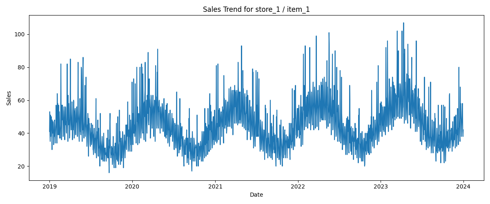

# Demand Forecasting EDA Report
## Single Time-Series Analysis (Store 1 - Item 1)

### Overview
This report analyzes the temporal behavior of a single store-item pair to identify patterns relevant for forecasting.

---

### Visualization

---

### Key Observations

#### Seasonality
- Clear repeating yearly patterns
- Strong weekly fluctuations

#### Trend
- Gradual upward trend over time

#### Variability
- High variance in daily sales
- Presence of sharp spikes (likely promotions)

#### Complexity
- Noisy and non-linear behavior

---

### Business Insights
- Demand depends on temporal patterns
- Promotions likely drive spikes
- Forecasting must handle seasonality and noise

---

### Modeling Implications
- Use lag features (t-1, t-7, t-30)
- Add rolling statistics
- Include calendar features
- Prefer tree-based models

---

### Conclusion
Demand is influenced by seasonality, growth trends, and irregular events. Robust feature engineering is required.
