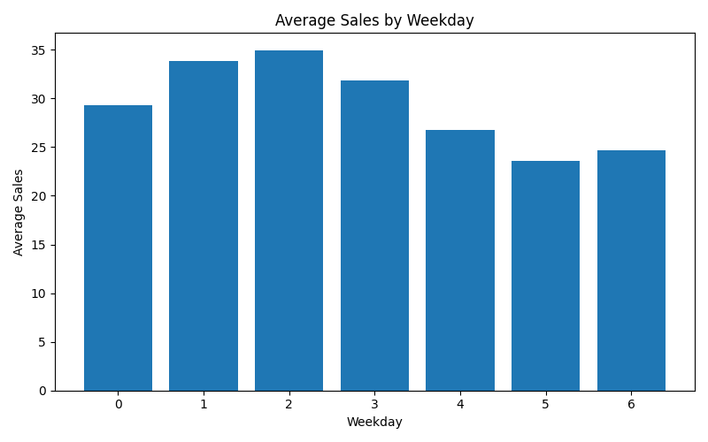

# Demand Forecasting EDA Report
## Weekly Seasonality Analysis

### Overview
This analysis examines how average sales vary across weekdays to identify short-term seasonal patterns.

---

### Visualization

---

### Key Observations

#### Weekly Pattern
- Sales peak around mid-week (weekday 2–3)
- Decline observed toward the end of the week

#### Low Demand Periods
- Lowest sales occur on weekday 5 and 6
- Suggests reduced customer activity

#### Stability
- Pattern is smooth and consistent
- Indicates strong weekly seasonality

---

### Business Insights
- Mid-week is the strongest sales period
- End-of-week slowdown may reflect:
  - reduced store activity
  - customer behavior cycles

---

### Modeling Implications
- Weekday must be included as a feature
- Consider cyclic encoding (sin/cos)
- Helps improve short-term forecasts

---

### Conclusion
Sales are strongly influenced by weekly cycles. Capturing weekday effects is essential for accurate demand forecasting.
