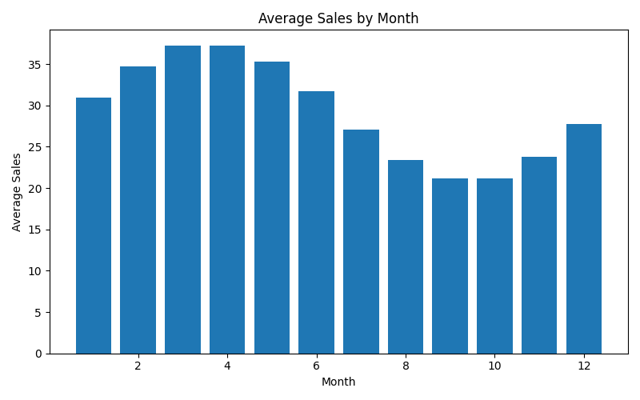

# Demand Forecasting EDA Report
## Monthly Seasonality Analysis

### Overview
This analysis examines how average sales vary across months to identify long-term seasonal patterns.

---

### Visualization

---

### Key Observations

#### Seasonal Pattern
- Sales peak in early months (March–May)
- Gradual decline toward late summer and early autumn

#### Low Demand Periods
- Lowest sales observed around September–October

#### Recovery Phase
- Demand starts increasing again toward the end of the year

---

### Business Insights
- Strong yearly demand cycle is present
- High demand periods may align with:
  - seasonal customer behavior
  - market cycles
- Low demand periods may require:
  - promotions
  - pricing strategies

---

### Modeling Implications
- Month is a critical feature
- Use cyclic encoding (sin/cos)
- Combine with trend and lag features

---

### Conclusion
Demand shows clear yearly seasonality with peak and low periods. Capturing monthly patterns is essential for long-term forecasting accuracy.
