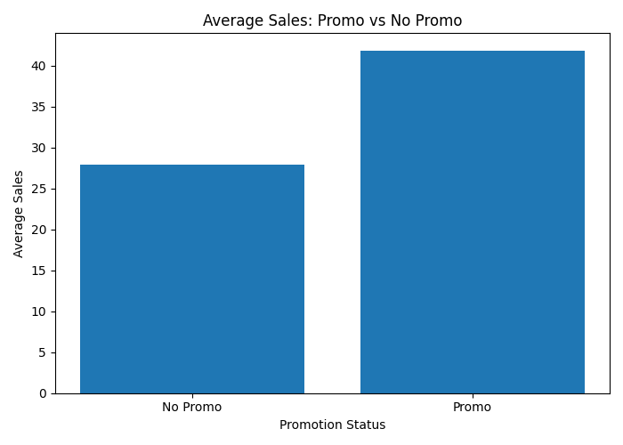

# Demand Forecasting EDA Report
## Promotion Impact Analysis

### Overview
This analysis compares average sales between promotional and non-promotional periods to evaluate the effect of promotions on demand.

---

### Visualization

---

### Key Observations

#### Strong Promotion Impact
- Sales during promotions are significantly higher than non-promo periods
- Clear uplift in demand when promotions are active

#### Magnitude
- Promotional sales are substantially greater (approx. +50% increase)

#### Consistency
- Effect appears stable and strong across observations

---

### Business Insights
- Promotions are a major driver of demand
- Customers are highly responsive to promotional events
- Promotions can be used strategically to boost sales

---

### Modeling Implications
- Promotion must be included as a key feature
- Interaction with price and time features should be considered
- Important for both short-term and long-term forecasting

---

### Conclusion
Promotions have a strong and consistent positive impact on sales. Ignoring this variable would significantly reduce model performance.
