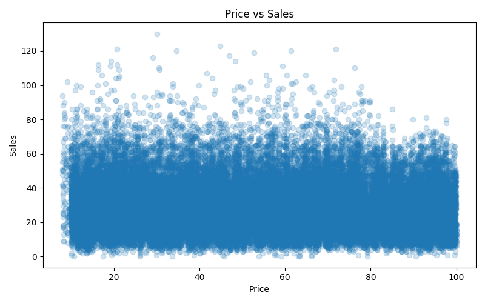

# Demand Forecasting EDA Report
## Price vs Sales Analysis

### Overview
This analysis examines the relationship between product price and sales volume to understand price sensitivity.

---

### Visualization

---

### Key Observations

#### Weak Relationship
- No strong linear relationship between price and sales
- Sales are widely distributed across all price levels

#### High Variability
- Large spread of sales values at each price point
- Indicates influence of other variables

#### Outliers
- Some high sales occur at both low and high prices
- Suggests external drivers (e.g., promotions)

---

### Business Insights
- Price alone does not determine demand
- Other factors (promotion, time, store, item) play a larger role
- Pricing strategy should consider context

---

### Modeling Implications
- Price should not be used alone
- Include interaction features:
  - price × promo
  - price × seasonality
- Tree-based models can capture non-linear effects

---

### Conclusion
The relationship between price and sales is weak and noisy. Demand is driven by multiple interacting factors rather than price alone.
