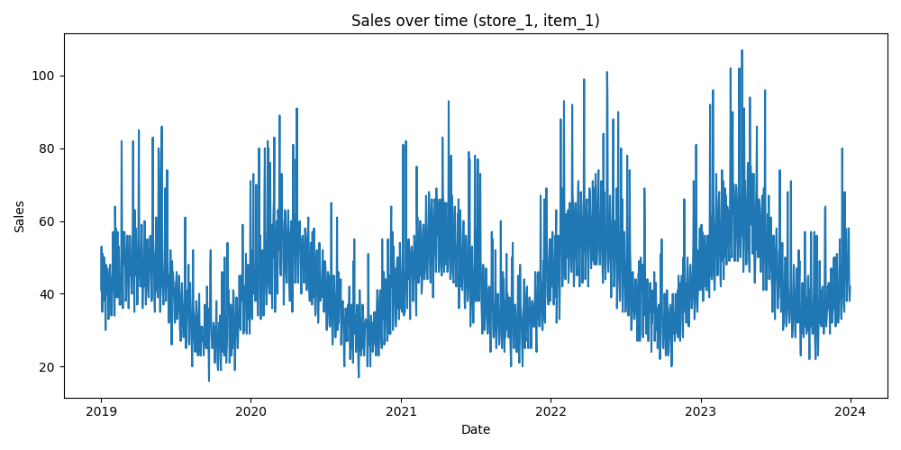

# Demand Forecasting EDA Report
## Sales Over Time Analysis (Store 1 - Item 1)

### Overview
This analysis examines the evolution of sales over time for a single store-item pair to identify trend and seasonal behavior.

---

### Visualization

---

### Key Observations

#### Trend
- Clear upward trend in sales over time
- Indicates growing demand

#### Seasonality
- Strong repeating yearly cycles
- Regular peaks and troughs across years

#### Variability
- Significant fluctuations around the trend
- Presence of spikes suggests external influences

---

### Business Insights
- Demand is increasing over time
- Seasonal demand cycles are strong and predictable
- Spikes likely driven by promotions or events

---

### Modeling Implications
- Include trend and seasonal features
- Use lag-based features
- Combine with promo and external variables

---

### Conclusion
Sales are driven by a combination of growth, seasonality, and irregular events. Effective forecasting must capture all these components.
