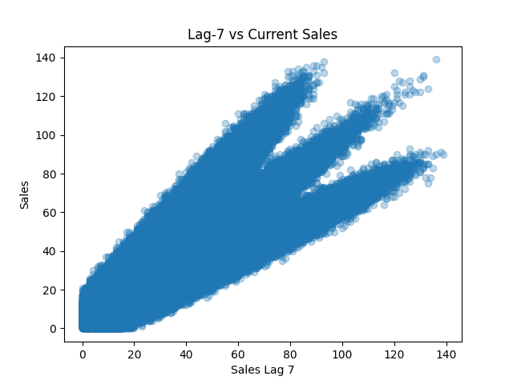

# Demand Forecasting EDA Report
## Lag Feature Analysis (Lag-7 vs Current Sales)

### Overview
This analysis examines the relationship between sales from 7 days ago (lag-7) and current sales to evaluate the predictive power of temporal dependencies.

---

### Visualization

---

### Key Observations

#### Strong Positive Relationship
- A clear upward pattern is observed
- Higher lag-7 values correspond to higher current sales

#### Weekly Dependency
- Sales tend to repeat similar patterns on a weekly basis
- Indicates strong weekly seasonality

#### Structured Patterns
- Multiple diagonal “bands” appear
- These represent different store-item behaviors

---

### Interpretation

- The model can use past weekly sales to predict current demand
- Demand is not random — it follows repeatable temporal structures
- Lag-7 captures short-term memory effectively

---

### Modeling Implications

- Lag-7 is a highly informative feature
- Essential for capturing weekly seasonality
- Should be included in all forecasting models

---

### Conclusion

The lag-7 feature demonstrates strong predictive power.  
This confirms that demand follows weekly patterns, making lag-based features critical for accurate forecasting.
