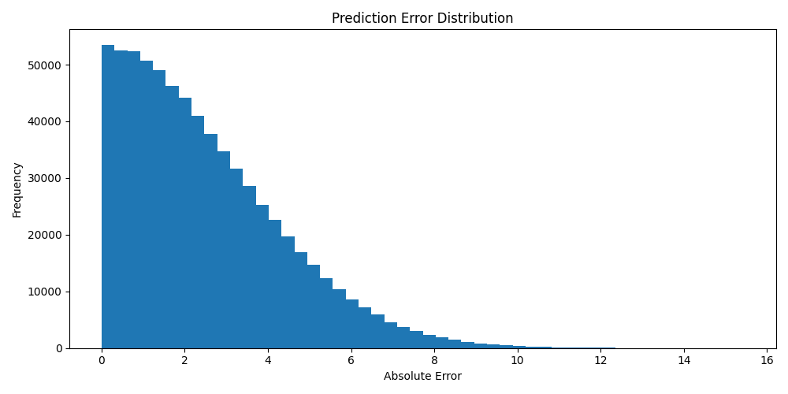

# Model Evaluation Report: Prediction Error Distribution

## Objective
This report analyzes the distribution of prediction errors from the LightGBM demand forecasting model.

The goal is to understand how reliable the model is across the test period and whether large forecasting errors occur frequently.

---

## Visualization

---

## Key Observations

### 1. Most Errors Are Small
The majority of predictions have low absolute error values, mostly concentrated between 0 and 4 sales units.

This indicates that the model is generally accurate for most store-item observations.

### 2. Right-Skewed Error Distribution
The distribution has a long right tail.

This means that while most predictions are accurate, a smaller number of cases produce larger errors.

### 3. Rare High-Error Cases
Large prediction errors are uncommon but still present.

These cases may correspond to:
- unusual demand spikes
- promotional effects
- irregular customer behavior
- store-item combinations with unstable demand

---

## Business Interpretation
The model performs reliably for the majority of demand predictions. However, the long-tail error behavior shows that some demand cases remain difficult to forecast.

From a business perspective, these high-error cases are important because they may lead to:
- stock shortages
- overstocking
- missed promotion planning
- poor inventory allocation

---

## Modeling Implications
This analysis justifies the need for further diagnostics beyond aggregate metrics such as RMSE or MAE.

Recommended next steps:
- analyze worst-performing store-item pairs
- inspect high-error periods
- compare errors during promo and non-promo periods
- add anomaly detection for unusual demand behavior

---

## Conclusion
The LightGBM model demonstrates strong overall forecasting performance, with most predictions producing low error. The remaining high-error cases provide useful direction for future model improvement and monitoring.

This analysis supports a production-style evaluation workflow because it examines not only average performance, but also model reliability and failure modes.
